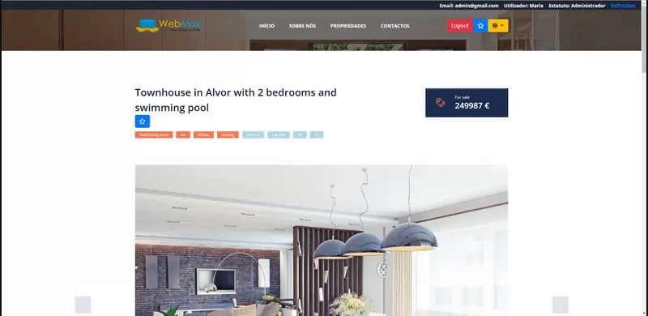

# Full Real Estate
Real Estate Website that contains all the necessary features.

## Features:
  - Login/Register;
  - Properties:
    - Keywords & Features;
    - Price EUR/USD;
    - Property Type (Villa/Apartment);
    - Sale Status (For Sale/ For Rental);
    - Images (SlideShow);
    - Description;
    - Reference;
    - Location (Country, District, City);
    - Number of Bedrooms/WC'S;
    - Total Area;
    - House Area;
    - Business Description;
    - Plot Area;
    - Plot Area SQF;
    - Property Condition;
    - Year that was built;
    - Internal ID;
    - Map (Latitude & Longitude);
    - Small profile of the agent;
    
  - Favorites
  - Translation to French/English/Portuguese
  - Back-Office:
    - Add Property;
    - Edit Users (Make a user Agent/Administrator);
    - Edit Properties;
    - Edit Profile;
    
  - Search Properties (Min/Max Price/SQ FT; Nª Bathrooms/Bedrooms; Property Type & Property Status);
  
  

  

  
  
  
